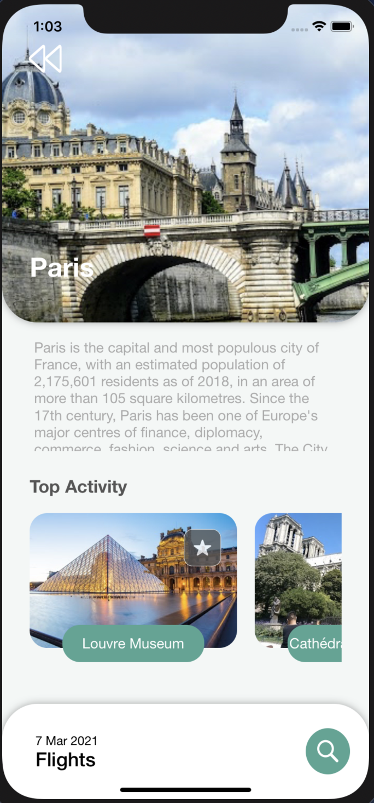
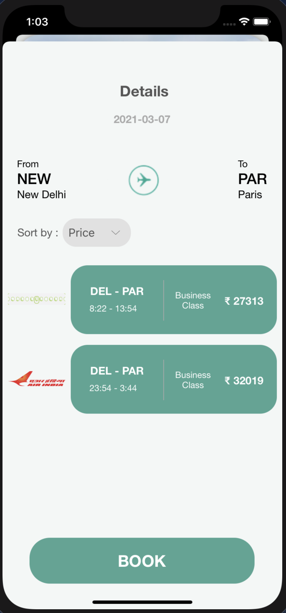
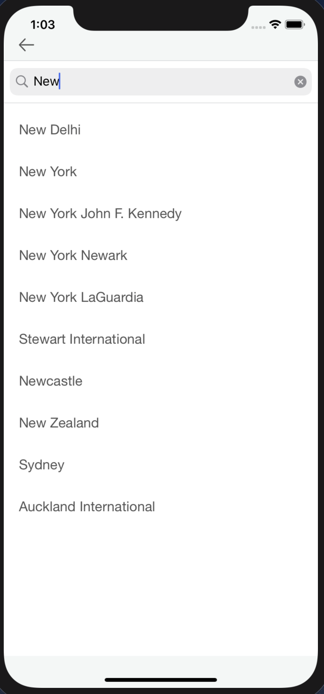
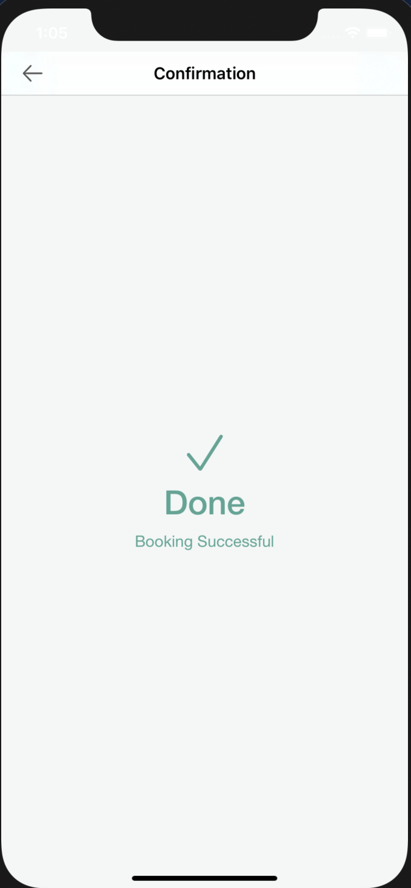

# Travelism
Travelism is an iOS app to check the top countries and their top most tourism destinations along with the interests.
Interests places can be marked as favorites and can be looked in a separate screen. Flight Bookings can also be done within the app.
It uses skyscanner API for the flight details and airports list.
It is based upon pure MVC Architecture.

## Citations

* https://dribbble.com/shots/14896063-Travel-Booking-Mobile-Apps
* https://github.com/siddhantmishra1305/Beer-ECommerce-App-iOS

## Screenshots

1. Home Screen

2. Destinations Screen

3. Flights Details

4. Airports List

5. Booking

6. Favorites Screen

## TODO

1. Profile Screen.

## Contact Me:

Email - poojabhasin402@gmail.com

